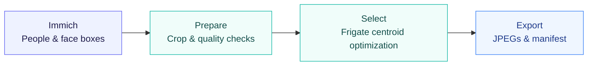

<div align="center">

# if-curator

### Face enrollment for Frigate, from your Immich library.

Prepare up to **30 quality-checked face crops per person**, with local inference,
centroid-aware selection, and an auditable export.

[](https://github.com/ds-sebastian/if_curator/actions/workflows/checks.yml)
[](https://www.python.org/downloads/)
[](https://docs.astral.sh/uv/)
[](LICENSE)

[Quick start](#quick-start) · [Workflow](#choose-review-export) · [How it works](#how-selection-works) · [Configuration](docs/configuration.md)

</div>

---

| The intended face | A useful identity set | An export you can inspect |
| :--- | :--- | :--- |
| Match the selected Immich person and check quality on their face. | Keep useful similar captures and optimize the Frigate identity centroid. | Export the exact evaluated JPEGs with scores, reasons, and file hashes. |

## Quick start

You’ll need **Python 3.12+**, **[uv](https://docs.astral.sh/uv/)**, and an Immich API key
with access to people, asset search, face metadata, and original/preview downloads.

```bash
git clone https://github.com/ds-sebastian/if_curator.git
cd if_curator
uv run if-curator
```

The first launch prompts for your Immich URL and API key, then saves the connection
in `.immich_config.json`. You can also supply them through environment variables or `.env`.

**Using an NVIDIA GPU?** Enable the GPU extra when launching:

```bash
uv run --extra gpu if-curator
```

Startup logs show the active execution providers. To explicitly use CPU inference:

```bash
FORCE_CPU=true uv run if-curator
```

The first face run downloads the local models: Buffalo_L plus Frigate’s ArcFace and
landmark models. The latter two total about **303 MiB** and have verified SHA-256 hashes.
All inference runs locally; photos are not uploaded to model providers.

## Choose, review, export

1. **Choose a person** from Immich, select face mode, and set a date range.
2. **Choose a ceiling** using one of the presets below.
3. **Queue other people** to include them in cross-person comparisons.
4. **Review the selection** and export. The preview separates scanned, quality-approved, eligible, and selected counts.

| Preset | Maximum | Selection |
| :--- | ---: | :--- |
| **Centroid** · default | 30 | Optimize the Frigate identity centroid |
| **Starter** | 5 | The same optimization with a smaller ceiling |
| **Custom** | Your count | Centroid optimization or explicit time spread |

Counts are ceilings. Selection can stop early when more images do not improve the
objective, and shortages never relax the quality gates.

> [!IMPORTANT]
> The supported model profile is **Frigate 0.17.2 large / ArcFace**. This tool prepares
> enrollment images using that profile; measured recognition performance requires
> independent camera evaluation. Review the crops before enrolling them in Frigate.

## How selection works



**Prepare the right face.** Immich supplies the person label and bounding box;
InsightFace verifies the local match. Size, sharpness, exposure, grayscale policy,
and detection confidence are checked on the intended face. The default is a natural
crop with a 15% margin and a minimum effective face size of 100 × 100 pixels.

**Choose images that work together.** Frigate ArcFace embeds each prepared JPEG.
The selector removes duplicate captures and isolated outliers, then tests additions,
swaps, and removals against the identity centroid. Independently captured similar
faces remain eligible. Other queued identities contribute to ambiguity scoring.

**Keep the result traceable.** Each exported JPEG is byte-for-byte identical to the
image evaluated. The manifest records quality measurements, selection reasons,
model identity, and leave-one-out diagnostics.

The subset search is a bounded heuristic. Without camera reference data, it uses a
capture-day-balanced reference from the Immich library. It does not fine-tune model
weights or modify your Immich labels or Frigate installation.

[Read the selection details →](docs/face-selection.md)

## Your export

Each completed run gets its own directory:

```text
frigate_train/
└── <timestamp>-<run-id>/
    ├── manifest.json
    └── Sebastian-<identity-hash>/
        ├── 000.jpg
        ├── 001.jpg
        └── …
```

The identity suffix distinguishes people with the same name. Use `manifest.json`
to map folders to their original Immich names and IDs.

Previous exports stay intact. Work in progress lives in a hidden `.incomplete`
directory; only completed runs are published. Interrupted or cancelled runs remain
marked incomplete, with their temporary artifacts available for inspection.

Inspect the selected crops, then enroll them using
[Frigate’s face recognition workflow](https://docs.frigate.video/configuration/face_recognition/).
The Starter preset limits count; it does not certify frontal pose.

## Optional camera evaluation

Use labeled camera crops to build a reference, tune selection, and evaluate on
separate test events:

```bash
uv run --extra gpu if-curator --camera-manifest camera/manifest.json
```

| Split | Purpose |
| :--- | :--- |
| **Reference** | Define the desired identity center |
| **Validation** | Guide subset selection |
| **Test** | Evaluate after selection is finished |

The report includes baseline comparisons, recognition rates, false acceptance,
and inference failures. Difficult crops remain in the metrics. Results apply to
individual crops; they do not reproduce Frigate’s detector or temporal tracking.

[Set up a camera manifest →](docs/camera-evaluation.md)

## Configuration

Defaults suit the basic workflow. Set overrides in your environment or `.env`:

```dotenv
FACE_MAX_IMAGES=30
MIN_FACE_WIDTH=100
FACE_MARGIN=0.15
USE_FULL_RESOLUTION=true
ENABLE_FACE_ALIGNMENT=false
```

The [configuration reference](docs/configuration.md) lists every setting, including
quality thresholds, caching, model paths, and Frigate evaluation scores.

<details>
<summary><strong>Troubleshooting GPU and environment setup</strong></summary>

**Another virtual environment is active.** If uv warns that `VIRTUAL_ENV` points to
a different project, it will ignore that variable and use this project’s `.venv`.
Leave the old environment or clear the variable for one invocation on Linux/macOS:

```bash
env -u VIRTUAL_ENV uv run --extra gpu if-curator
```

**CUDA libraries cannot be loaded.** Launch with `--extra gpu` and check the active
providers in the startup logs. The application preloads CUDA libraries from the
installed NVIDIA packages before creating ONNX sessions. The locked environment
does not require you to import PyTorch first or install a separate CUDA toolkit.

**`cv2.face` is missing.** Install with `uv sync --locked --extra gpu`. The project
uses `opencv-contrib-python-headless` for Frigate’s landmarks and excludes overlapping
standard OpenCV wheels. Installing those wheels separately can hide `cv2.face`.
Both OpenCV 4 and 5 landmark layouts are supported.

</details>

<details>
<summary><strong>Object mode</strong></summary>

Choose **Object** during setup to use SigLIP embeddings and YOLO object cropping.
Its Auto, Standard, Broad, and Custom strategies use K-Medoids and farthest-point
selection, with exports in the same isolated run directories.

Image loaders apply EXIF orientation and RGB conversion. Older SigLIP cache entries
are ignored because they may reflect uncorrected orientation. Object mode prepares
images for external workflows; it does not train or upload a custom detector.

</details>

## Development

```bash
uv sync --locked
uv run pytest -q
uv run ruff check .
```

The regression suite mocks APIs and embeddings and runs without model downloads.
CI checks the locked dependencies, tests, and Ruff. Contributions should preserve
correct target association, mandatory quality gates, and identical evaluated/exported bytes.

---

Built with [Immich](https://immich.app), [Frigate](https://frigate.video),
[InsightFace](https://github.com/deepinsight/insightface), and
[Ultralytics](https://github.com/ultralytics/ultralytics).

[MIT license](LICENSE) · [Third-party notices](THIRD_PARTY_NOTICES.md)
