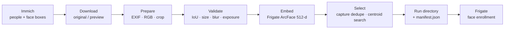

<div align="center">

# if-curator

**Curate face-enrollment sets in [Immich](https://immich.app) → export them for [Frigate](https://frigate.video).**

Exports **up to 30 natural face crops per person** by default, with quality measured on the
intended face rather than the whole image. Object preparation with SigLIP and YOLO is also available.

<p>
  <a href="https://www.python.org/downloads/"></a>
  <a href="LICENSE"></a>
  <a href="https://github.com/astral-sh/uv"></a>
  <a href="https://github.com/astral-sh/ruff"></a>
</p>

<p>
  <a href="https://immich.app"></a>
  <a href="https://frigate.video"></a>
</p>

</div>

---

## Contents

- [How it works](#how-it-works)
- [Installation](#installation)
- [Face workflow](#face-workflow)
  - [Preparation and quality](#preparation-and-quality)
  - [Representative selection](#representative-selection)
- [Output and reruns](#output-and-reruns)
- [Configuration](#configuration)
- [Using the results with Frigate](#using-the-results-with-frigate)
- [Object mode](#object-mode)
- [Development](#development)
- [Related projects](#related-projects)

---

## How it works

[Immich](https://immich.app) provides person labels and face bounding boxes. `if-curator`
uses a local [InsightFace](https://github.com/deepinsight/insightface) Buffalo_L detector
to validate each target crop. Frigate’s large ArcFace model evaluates candidate
subsets against an identity reference and the other queued identities. It prepares each JPEG once, evaluates that
exact image, and exports its bytes unchanged into a new run directory.



> [!IMPORTANT]
> **Scope.** This prepares enrollment examples. It does **not** train or improve Frigate's
> upstream face detector or fine-tune ArcFace weights. The compatibility profile targets
> **Frigate 0.17.2 large**, including alignment, raw embeddings, coordinate trimming and
> confidence conversion. Without independent camera test crops, selection remains a
> source-library heuristic and does not certify recognition accuracy.

---

## Installation

**Prerequisites**

| Requirement | Notes |
| --- | --- |
| Python 3.12+ | See [python.org](https://www.python.org/downloads/) |
| [uv](https://astral.sh/uv/) | Used for dependency resolution and running the CLI |
| An [Immich API key](https://immich.app/docs/features/command-line-interface#obtain-the-api-key) | Must be able to read people, search assets, retrieve face metadata, and download originals/previews |

```bash
git clone https://github.com/ds-sebastian/if_curator.git
cd if_curator

uv sync
uv run if-curator
```

<details>
<summary><b>GPU inference</b></summary>

```bash
uv sync --extra gpu
uv run --extra gpu if-curator
```

ONNX Runtime selects available execution providers; CPU fallback is supported.
Set `FORCE_CPU=true` to restrict inference to CPU.

</details>

The first face run downloads Buffalo_L plus Frigate’s `arcface.onnx` and
`landmarkdet.yaml` (about 303 MiB for the latter two). Frigate artifacts are checked
against pinned SHA-256 hashes. Downloads and all inference remain local to this tool;
images are not uploaded to model providers.

---

## Face workflow

1. Select an Immich person, face mode, and date range.
2. Choose a preset:

   | Preset | Ceiling | Selection |
   | --- | --- | --- |
   | **Centroid** | up to 30 | Frigate centroid optimization |
   | **Starter** | up to 5 | Frigate centroid optimization |
   | **Custom** | your count | Centroid optimization **or** explicit time spread |

3. Queue every identity you want included in cross-person comparisons. Candidates are
   prepared before final joint selection.
4. Review selected/prepared/rejected counts and the reference source, then export.

> [!NOTE]
> Counts are **ceilings**. A shortage never relaxes quality gates or fills from rejected
> images. Local face detection remains mandatory in time-spread mode. Model or selection
> failure never silently falls back to an unfiltered face export.

### Preparation and quality

| Stage | Rule |
| --- | --- |
| **Identity** | Metadata must identify exactly one face for the requested person. If nested asset metadata is incomplete, the tool retrieves `/api/faces?id=…`. Asset searches explicitly request people metadata to avoid unnecessary per-asset requests. |
| **Box match** | A local detection must match the target box with intersection-over-union of at least `0.5`. Missing or ambiguous matches are rejected, including montages with multiple faces assigned to the same person. |
| **Decoding** | Originals are fully decoded, EXIF-oriented, and converted to RGB. Unsupported formats and failed original downloads fall back to a JPEG preview. |
| **Coordinates** | Coordinates are scaled to the decoded representation. Invalid, incomplete, or incompatible boxes are rejected. Assets marked as edited are conservatively rejected because their box/original coordinate relationship is not yet verified. |
| **Size** | Both effective face dimensions must be at least 100 pixels **before** margin, resizing, or alignment. Preview fallback must independently satisfy this rule. |
| **Cropping** | Natural-resolution crops have a 15% margin by default. Optional 112×112 alignment uses local landmarks, followed by validation of the resulting encoded crop. Target landmarks are projected through that transform; the tight aligned crop does not undergo a second detector pass — its detection confidence comes from the matched face before alignment. |
| **Quality** | Blur, exposure, and grayscale checks operate on the face region of the encoded JPEG, excluding the margin/background. Grayscale detection compares channels at each pixel, rather than comparing global channel averages. |
| **Confidence** | Detection confidence comes from the matched local detector. Public Immich face metadata is not assumed to provide confidence, landmarks, or embeddings. |

The manifest records measured sharpness, brightness, channel differences, and local
detection confidence. These are quality heuristics; the tool does not claim to measure
occlusion or landmark confidence.

### Representative selection

Smart face selection uses this deterministic pipeline:

1. **Gate** geometry, size, exposure, blur and local detection confidence; embed the
   exact prepared JPEG using Frigate’s large recognizer. Raw 512-dimensional outputs
   are retained because normalization before coordinate trimming changes the centroid.
2. **Deduplicate captures**, using identical prepared bytes, asset/stack/burst identity,
   or near-identical 16×16 color thumbnails within two seconds. Keep the better crop
   by detection confidence, facial sharpness, effective resolution, then stable IDs.
   Independently captured similar faces remain eligible. No embedding-distance dedupe.
3. **Filter isolation** using five-neighbor mean cosine distance and median plus three
   scaled MADs when at least ten candidates remain; skip when dispersion is zero.
4. **Build a reference** from correctly labeled camera reference crops when supplied.
   Otherwise use a geometric median of normalized Immich embeddings with equal total
   weight per capture day. This reduces the influence of repeated shooting sessions.
5. **Search subsets**, starting at the reference-nearest face and rebuilding Frigate’s
   15% coordinate-wise trimmed mean for additions, swaps and removals. With validation
   crops, minimize correct-identity cosine loss, competing-identity margin violations,
   recognition-threshold shortfalls and unknown false-accept risk. Without them,
   minimize reference-direction loss and ambiguity against other queued identities.
6. **Stop on no improvement**, up to the requested ceiling. Additions search the full
   surviving pool; swaps search at most 128 candidates drawn from reference proximity,
   quality and time spread. Two passes across identities and bounded exchanges keep
   runtime finite. The manifest reports the shortlist and any iteration cap reached.

This is a bounded local search, not a globally optimal solution. Similarity to your own
full enrollment centroid is not independent validation. The manifest instead includes
**leave-one-out** similarity, Frigate confidence and rival margin for each selected
image; a singleton cannot supply a leave-one-out score. Candidate reference similarity,
isolation and rival margins are also recorded. No fixed diversity ratio is imposed.

The objective averages identity-level losses. Its cosine margin defaults to `0.1`;
validation adds a `0.1` reference regularizer and gives unknown threshold violations
weight `2`. These are curation heuristics, not statistically calibrated constants.
Incorrect labels and coherent mislabeled clusters can still survive: review the crops.
Time spread uses quality-approved embeddings and the requested ceiling, without smart
capture deduplication, isolation filtering or centroid optimization.

### Optional camera reference and evaluation data

Provide **already cropped, correctly labeled camera faces** in a local JSON manifest:

```bash
uv run if-curator --camera-manifest camera/manifest.json
```

```json
{
  "schema_version": 1,
  "samples": [
    {"id": "ref-1", "person_id": "IMMICH_PERSON_ID", "split": "reference", "capture_group": "event-1", "path": "ref.jpg"},
    {"id": "val-1", "person_id": "IMMICH_PERSON_ID", "split": "validation", "capture_group": "event-2", "path": "val.jpg"},
    {"id": "test-1", "person_id": "IMMICH_PERSON_ID", "split": "test", "capture_group": "event-3", "path": "test.jpg"},
    {"id": "unknown-1", "person_id": null, "split": "test", "capture_group": "event-4", "path": "unknown.jpg"}
  ]
}
```

Paths resolve relative to the manifest. `person_id` is mandatory; `null` explicitly
means someone who is not enrolled. Queue all labeled identities in face mode. Group
all frames/crops from the same camera event under one `capture_group`; groups, file
hashes and optional Immich `asset_id` values must not cross splits. Supply `asset_id`
when a crop comes from an Immich asset so enrollment leakage can be detected. Re-encoded
or recropped versions cannot reliably be recognized as the same event without metadata.

Reference crops determine the desired center. Validation crops tune the subset. Test
crops are embedded **after selection** and never affect it. Camera crops are not exported
as enrollment images in this workflow. Do not use test results to repeatedly tune the
same benchmark; reserve new events for subsequent independent evaluation.

The run manifest reports per-crop correct recognition, wrong-identity acceptance,
unknown false acceptance and inference failures, alongside a one-image baseline.
Failed and difficult crops stay in denominators. An unavailable rate is `null`, never
an invented zero. This does not reproduce Frigate’s detector, tracking or temporal
aggregation, and frame-level rates are not independent event-level statistics.
Match `FRIGATE_UNKNOWN_SCORE`, `FRIGATE_RECOGNITION_THRESHOLD` and the blur policy to
your installation before interpreting results. The default profile is latest stable
0.17.2; unverified release numbers fail rather than silently claiming parity. The profile
follows the [stable recognizer](https://github.com/blakeblackshear/frigate/blob/v0.17.2/frigate/data_processing/common/face/model.py)
and [embedding preprocessing](https://github.com/blakeblackshear/frigate/blob/v0.17.2/frigate/embeddings/onnx/face_embedding.py).

---

## Output and reruns

Each run receives a unique timestamp/ID directory:

```text
frigate_train/
└── 20260904T123000000000Z-abcd1234/
    ├── manifest.json
    └── Person-<identity-hash>/
        ├── 000.jpg
        └── 001.jpg
```

Folder suffixes distinguish people with identical names. Consult the manifest for original
person names and IDs when enrolling images in Frigate.

- **Atomic runs.** During preparation, a hidden `.<run-id>.incomplete` directory holds staged
  crops and the manifest. A completed run is published by renaming its directory. Failed,
  interrupted, or cancelled runs remain marked incomplete; they are not enrollment sets.
- **Non-destructive.** Prior runs and existing manually curated images are never overwritten or
  cleaned automatically. Temporary prepared crops are removed when publishing; rejection reasons
  remain in the manifest.
- **Manifest.** The versioned manifest includes processing settings (excluding credentials),
  model fingerprint, candidate provenance, source/effective dimensions, quality scores, selection
  and rejection reasons, output paths, and SHA-256 hashes.
- **Sampling.** Up to 3,000 assets per person are sampled evenly through time; excluded assets
  are recorded.
- **Bandwidth.** Downloads use windows of eight workers and stage decoded sources on disk, keeping
  full-size images out of the in-memory candidate collection. Preparation can require substantial
  network traffic; `USE_FULL_RESOLUTION=false` uses previews with the same gates.

---

## Configuration

The first run prompts for `IMMICH_URL` and `API_KEY` and stores connection details in
`.immich_config.json`. Environment values override saved connection settings. Processing
settings come from the environment (including `.env`) or these defaults.

### Connection

| Variable | Default | Meaning |
| --- | --- | --- |
| `IMMICH_URL` | **required** | [Immich](https://immich.app) server URL |
| `API_KEY` | **required** | Immich API key |
| `OUTPUT_DIR` | `./frigate_train` | Parent directory for isolated runs |

### Selection and filtering

| Variable | Default | Meaning |
| --- | --- | --- |
| `YEARS_FILTER` | `10` | Default age cutoff in years |
| `MIN_FACE_WIDTH` | `100` | Minimum effective width **and height** before resizing |
| `BLUR_THRESHOLD` | `100.0` | Minimum face-region Laplacian variance |
| `MIN_CONFIDENCE` | `0.7` | Minimum matched local detection confidence |
| `FACE_MAX_IMAGES` | `30` | Default face selection ceiling |
| `FACE_BURST_SECONDS` | `2.0` | Maximum time gap for thumbnail-based burst suppression |
| `FACE_PIXEL_DUPLICATE_DISTANCE` | `0.02` | Mean absolute 16×16 RGB difference, scaled to 0–1 |
| `FACE_OPTIMIZATION_EPSILON` | `0.00001` | Minimum objective improvement for an accepted change |
| `FACE_IDENTITY_MARGIN` | `0.1` | Desired correct-versus-rival cosine margin |
| `FRIGATE_VERSION` | `0.17.2` | Verified large-recognizer profile |
| `FRIGATE_MODEL_DIR` | `.if_cache/frigate` | Checksummed ArcFace and LBF model cache |
| `FRIGATE_UNKNOWN_SCORE` | `0.8` | Per-crop unknown acceptance threshold |
| `FRIGATE_RECOGNITION_THRESHOLD` | `0.9` | Per-crop recognition threshold for evaluation |
| `FRIGATE_BLUR_CONFIDENCE_FILTER` | `true` | Apply Frigate’s whole-crop blur confidence reduction |
| `CAMERA_MANIFEST` | empty | Optional local reference/validation/test manifest; CLI flag takes precedence |
| `FACE_OUTLIER_MAD` | `3.0` | Smart isolation threshold multiplier |
| `REJECT_GRAYSCALE` | `true` | Reject grayscale enrollment crops |
| `MAX_AUTO_IMAGES` | `80` | **Object-mode only** auto-selection ceiling |

### Image handling and runtime

| Variable | Default | Meaning |
| --- | --- | --- |
| `FACE_MARGIN` | `0.15` | Margin on each side as a fraction of face size |
| `USE_FULL_RESOLUTION` | `true` | Prefer originals, with preview fallback |
| `ENABLE_FACE_ALIGNMENT` | `false` | Export locally aligned 112×112 crops instead of natural crops |
| `FORCE_CPU` | `false` | Restrict inference to CPU |
| `ENABLE_CACHE` | `false` | Cache embeddings on disk |
| `CACHE_DIR` | `.if_cache` | Embedding cache directory |

Booleans accept `true/false`, `yes/no`, or `1/0`. Invalid settings fail validation.

Face cache keys include person/face/asset identity, encoded-image hash, model-file fingerprint,
and preprocessing version. Old face cache entries are ignored; caching does not bypass current
quality validation or eliminate image downloads.

---

## Using the results with Frigate

[Frigate's face recognition guidance](https://docs.frigate.video/configuration/face_recognition/)
recommends starting with 1–5 clear frontal images, then expanding methodically with correctly
labeled camera examples. The **Starter** preset limits count; it does not certify frontal pose,
so review the selected crops. The default **Centroid** set is a pool of up to 30 enrollment
candidates, not a recommendation to import all at once.

> [!NOTE]
> Frigate's large ArcFace pipeline uses its own model and alignment/scoring; its small mode uses
> FaceNet. Immich's person clustering has a different purpose again. Recognition performance on
> camera imagery requires evaluation in that environment. This tool compares queued identities
> and evaluates local camera crops, but does not connect to or modify a Frigate installation.

---

## Object mode

Object mode retains SigLIP embeddings, K-Medoids plus farthest-point selection, and YOLO object
cropping. Its existing **Auto**, **Standard**, **Broad**, and **Custom** strategies are separate
from face policies. Exports use the same isolated run directories.

All face/object loaders share EXIF correction and RGB decoding. Older SigLIP cache entries are
ignored because their embeddings may reflect uncorrected orientation. This prepares images for
external workflows; it does not upload or train a custom Frigate object detector.

---

## Development

```bash
uv sync --locked
uv run pytest -q
uv run ruff check .
```

Tests mock APIs and embeddings so they run without network access or model downloads.
They cover raw-centroid math, preprocessing, OpenCV landmark layouts, selection,
identity margins, split leakage, cache separation and byte-identical publication.

Install with `uv`: the lock excludes transitive standard OpenCV wheels and uses
`opencv-contrib-python-headless` to provide LBF landmarks. Installing overlapping
OpenCV distributions with another installer can hide `cv2.face`. OpenCV 4 and 5
landmark layouts are handled explicitly. Object-mode SigLIP/YOLO behavior is retained.

---

## Related projects

| Project | Role here |
| --- | --- |
| [Immich](https://immich.app) · [docs](https://immich.app/docs) · [GitHub](https://github.com/immich-app/immich) | Source library — supplies people, face bounding boxes, and image originals |
| [Frigate](https://frigate.video) · [docs](https://docs.frigate.video) · [GitHub](https://github.com/blakeblackshear/frigate) | Destination — consumes the exported crops as face enrollment images |
| [InsightFace](https://github.com/deepinsight/insightface) | Local Buffalo_L target detection and optional export alignment |
| [Ultralytics YOLO](https://github.com/ultralytics/ultralytics) | Object detection and cropping in object mode |

---

## License

[MIT](LICENSE) © Sebastian
